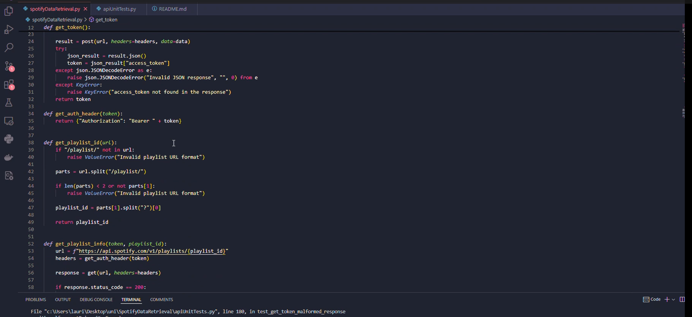

# Spotify Data Retrieval with Unit Tests

## How to reproduce unit tests

* Log in to your [Spotify dor Developers](https://developer.spotify.com/) account
* Get your credentials
* Insert them to .env file as  shown in .env.template

## Video

